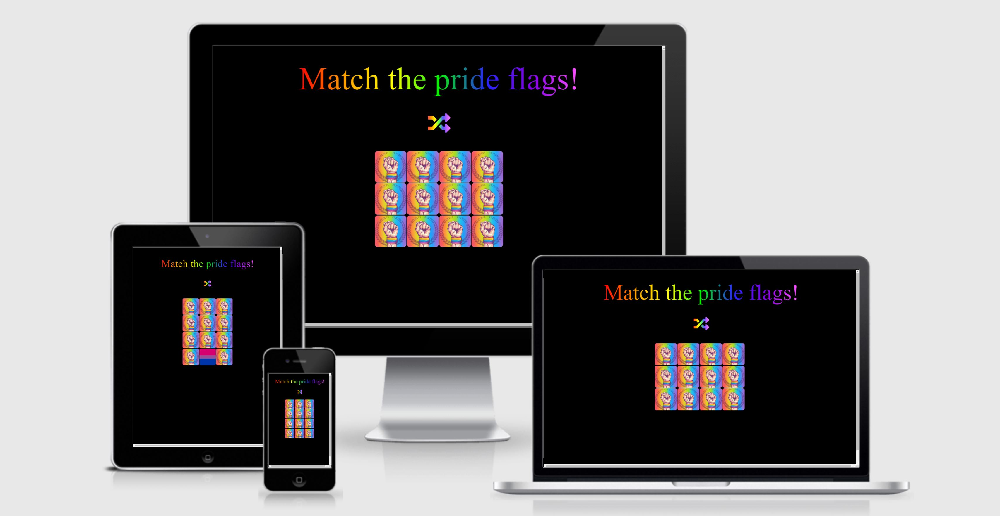
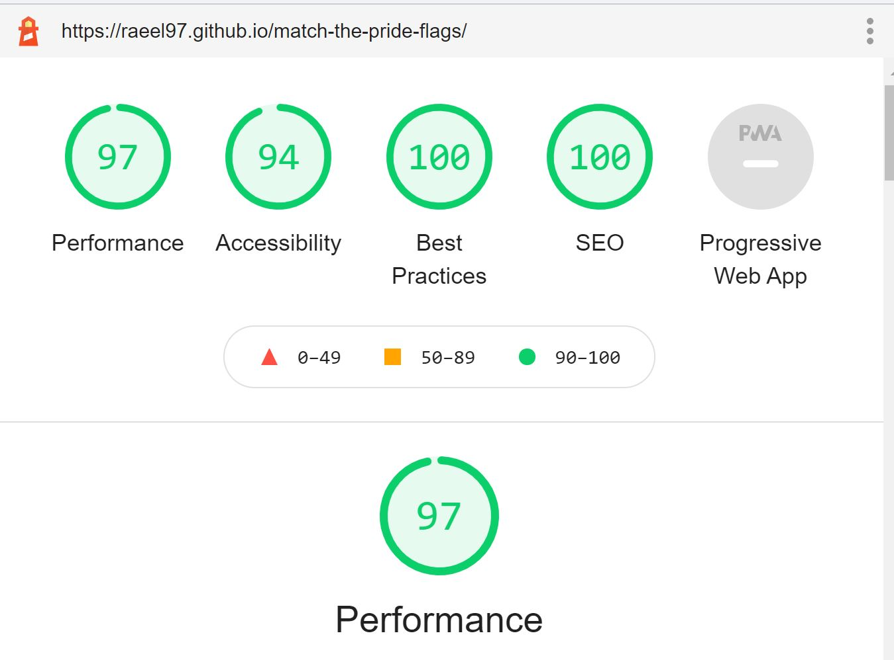
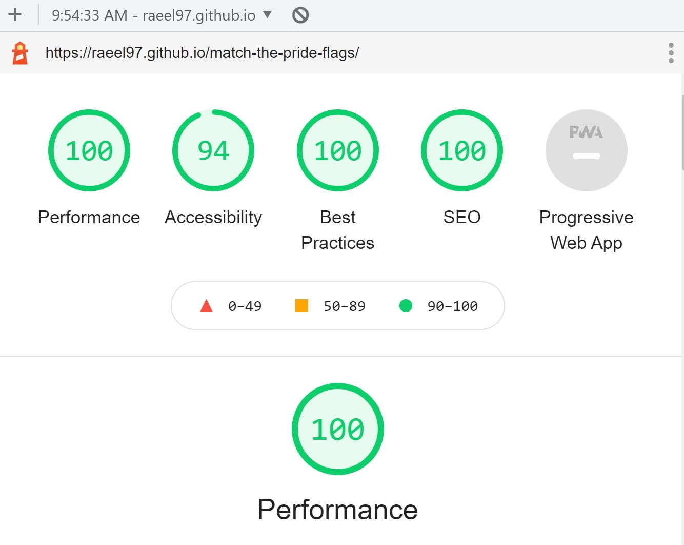
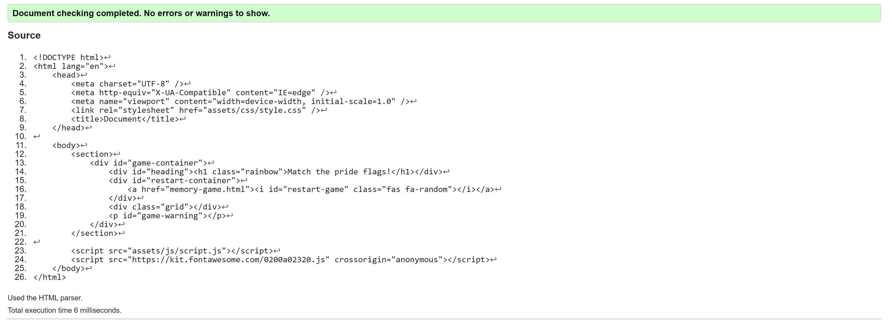
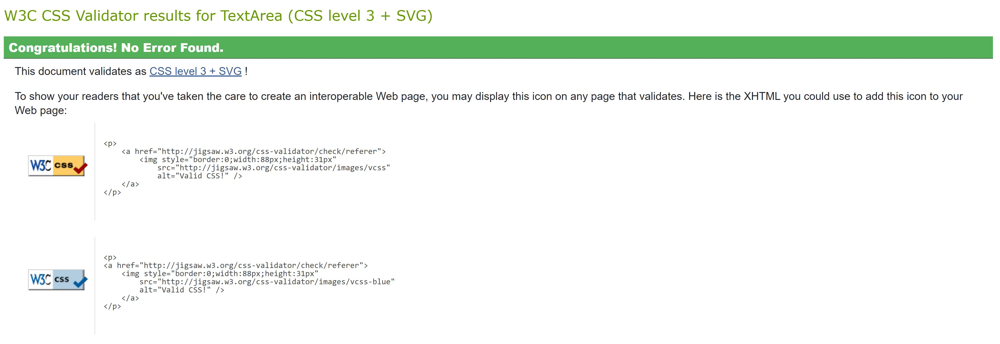
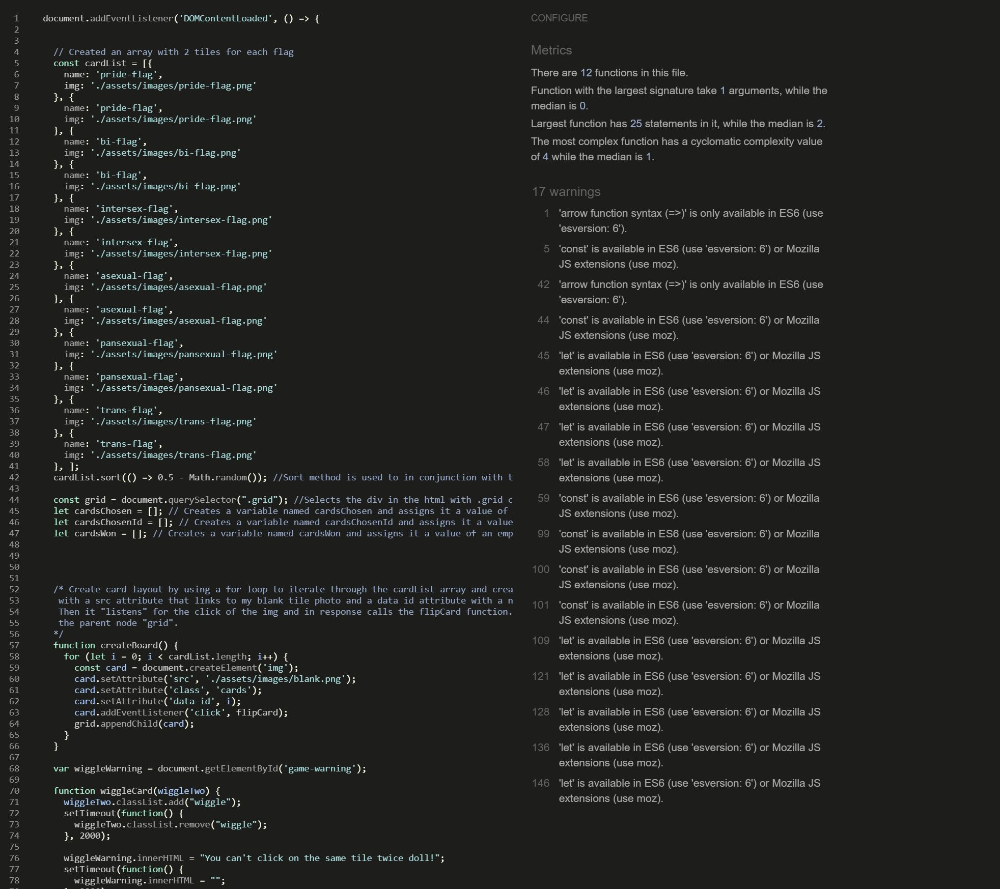

<h1 style="background-image: linear-gradient(to left, rgb(255, 83, 255), rgb(132, 0, 226), rgb(37, 37, 247), rgb(8, 240, 8), yellow, orange, red); -webkit-background-clip: text; -webkit-text-fill-color: transparent; margin: 0 auto; width: fit-content; font-size: 800%;font-size: 7vw;">Match The Pride Flags</h1>

## Tabel of contents
- <a href="#overview1">Overvew</a>
  - <a href="#overview2">What is this website for?</a>
  - <a href="#overview3">What does it do?</a>
  - <a href="#overview4">How does it work?</a>
- <a href="#features1">Features</a>
  - <a href="#features2">Existing Features</a>
  - <a href="#features3">Features Left to Implement</a>
- <a href="#tech">Technologies Used</a>
  - <a href="#tech1">Frameworks Libraries and Programmes Used</a>
- <a href="#test1">Testing</a>
  - <a href="#test2">Lighthouse Testing</a>
  - <a href="#test3">Validator Testing</a>
- <a href="#deployment">Deployment</a>
- <a href="#credit1">Credits</a>
  - <a href="#credit2">Code</a>
  - <a href="#credit3">Media</a>
  - <a href="#credit4">Acknowledgments</a>

<h2 id="overview1">Overview</h2>

<h3 id="overview2"> What is this website for?</h3>

Match the pride flags is a simple one level tile matching game with a theme in celebration of pride month. 

<h3 id="overview3"> What does it do?</h3>

The Match the pride flags game is simple, there are 6 pairs of pride flags hidden randomly under identical cards. The goal of the game is to match each pair of flags by clicking on two cards at a time. Once all the pairs have been selected, the game is won. 

<h3 id="overview4">How does it work?</h3>
The game is built and styled using HTML, CSS and Vanilla Javascript. The live site can be viewed <a href="https://raeel97.github.io/match-the-pride-flags/" target="_blank">here</a>  
The wireframes can be viewed <a href="https://drive.google.com/drive/folders/1TptRYKftXfu9MB07vW2qt07NjJUql_nA?usp=sharing" target="_blank">here</a>.

<h2 id="features1">Features</h2>

<h3 id="features2">Existing Features</h3>

<ol>
<li>A rainbow themed header.</li> 
<li>6 pairs of tiles that can be flipped over to reveal a pride flag underneath</li>
<li>A rainbow shuffle icon that acts a shuffler for the tiles by refreshing the page </li>
<li>A game alert system that informs users when they make a match between tiles or when they make a mistake</li>
</ol>
 
<h3 id="features3">Features Left to Implement</h3>
<ul>
<li>A new homepage will be added with 10 tiles displaying each of the major flags that can be flipped over to reveal information about each flag </li>
<li>Audio that reacts when users make a match, win, a mismatch and click on the same tile</li>
<li>A feedback and contact form will be added so that users are able to input suggestions</li>
<li>A audio mute button</li>
<li>3 levels of difficulty</li>
</ul>
 
<h2 id="tech">Technologies Used</h2>
<h3 id="tech1">Languages Used</h3>
<ul>
<li>HTML</li>
<li>CSS</li>
<li>Javascript</li>
</ul>

<h3 id="tech2">Frameworks Libraries and Programmes Used</h3> 
<ul>
<li><a href="https://fontawesome.com/" target="_blank">Font Awesome</a> - used for icons.</li>
<li><a href="https://github.com/" target="_blank">GitHub</a> - used to host repository.</li>
<li><a href="https://www.gitpod.io/" target="_blank">GitPod</a> - used to develop project and organise version control.</li>
<li><a href="https://pages.github.com/" target="_blank">GitHub Pages</a> - used to deploy the site.</li>
<li><a href="https://developers.google.com/web/tools/lighthouse" target="_blank">Lighthouse</a> - for performance review.</li>

<li><a href="https://www.canva.com/" target="_blank">Canva</a> - used to create wireframes and design image elements</li>
</ul>

<h2 id="test1">Testing</h2>

<h3 id="test2">Lighthouse Testing</h3>
- Code was written using Gitpod and tested using Chrome Devtools Lighthouse:   

Mobile lighthouse report
 

 Desktop lighthouse report
  
- All code used on the site has been tested to ensure everything is working as expected
- Site viewed and tested in the following browsers:
  - Google Chrome
  - Microsoft Edge
  - Mozilla Firefox 

 

<h3 id="test3">Validator Testing</h3>

- HTML was validated using [W3C Validator](https://validator.w3.org/)

 HTML Validator report
  
- CSS was validated using [W3C Jigsaw Validator](https://jigsaw.w3.org/css-validator/)

 CSS Validator report
  

  - Javascript was validated using [JS Hint](https://jshint.com/)

 JS Hint report
  

  <h3 id="test3">Bugs</h3>

  - Restart button and heading veer off to the left in Firefox
  - Game warning is displayed early to too quickly when users click on the tiles quickly
  - Tile doesn't flip over when a mismatch occurs if the user clicks on a third tile in a fast manner

<h2 id="deployment">Deployment</h2>

The website was deployed to github pages through the following steps:
<ol>
<li>Navigate to github in the browser.</li>
<li>Sign in with user credentials.</li>
<li>Navigate to repositories.</li>
<li>Select the repository to deploy.</li>
<li>Select settings from the menu bar.</li>
<li>Scroll to Github Pages section.</li>
<li>Select Master branch from source drop down.</li>
<li>Click Save</li>
<li>Refresh page.</li>

</ol>

Github pages will now deploy the site automatically and update any changes pushed to the master branch.
<h2 id="credit1">Credits</h2> 
<h3 id="credit2">Code</h3>
<ul>
<li>Most of the code was built using a tutorial created by <a href="https://github.com/kubowania" target="_blank">Ania Kubów</a>. The link to the tutorial can be found <a href="https://drive.google.com/file/d/1bq5xbM3hVl5W9sZCwPgNd9v6XdRT6WoO/view?usp=sharing"  target="_blank">here</a>.
 </li>
<li>StackOverflow, The Code Institute tutor team and W3Schools were used when problems were encountered</li>
</ul>
<h3 id="credit3">Media</h3>
Credits for all the flag images can be given to wikipedia. 
The back side of the tiles was created using Canva. 
  
<h3 id="credit4">Acknowledgments</h3>
I would like to thank my mentor, Chris Quinn, and my student advisor, Kasia Bogucka, as well at Jack at the Code Institutes tutor team for their patience and support, without it, I would have given up ages ago!   I would further like to thank The Code Institute as well as the slack community. I would also like to thank Ania Kubów for the awesome tutorial. 